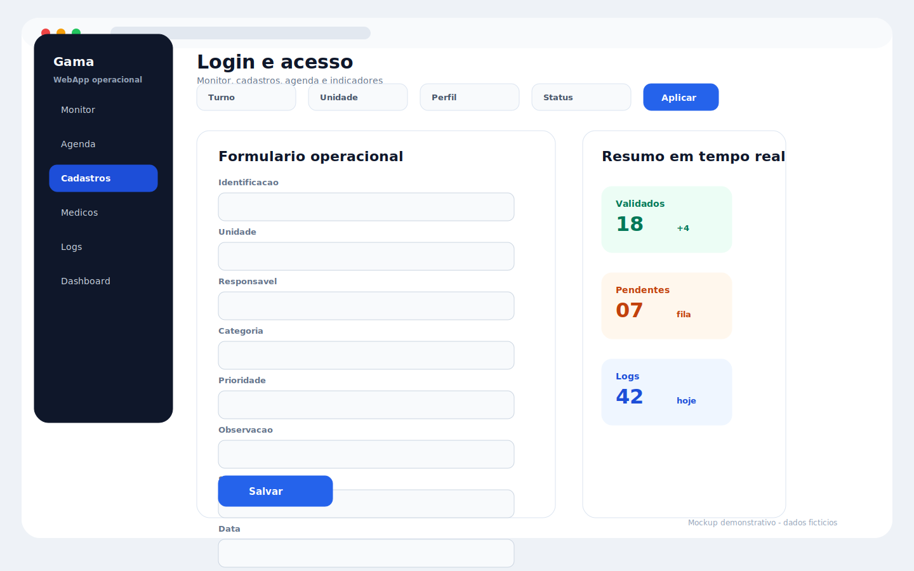
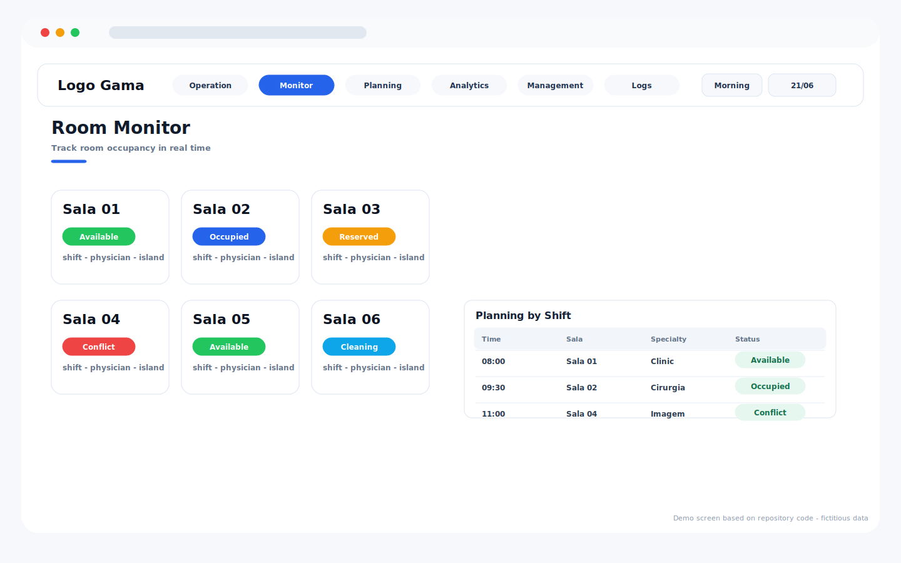
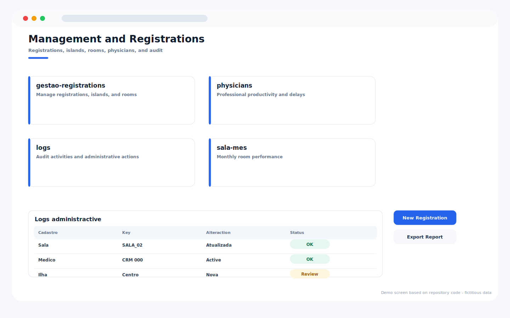
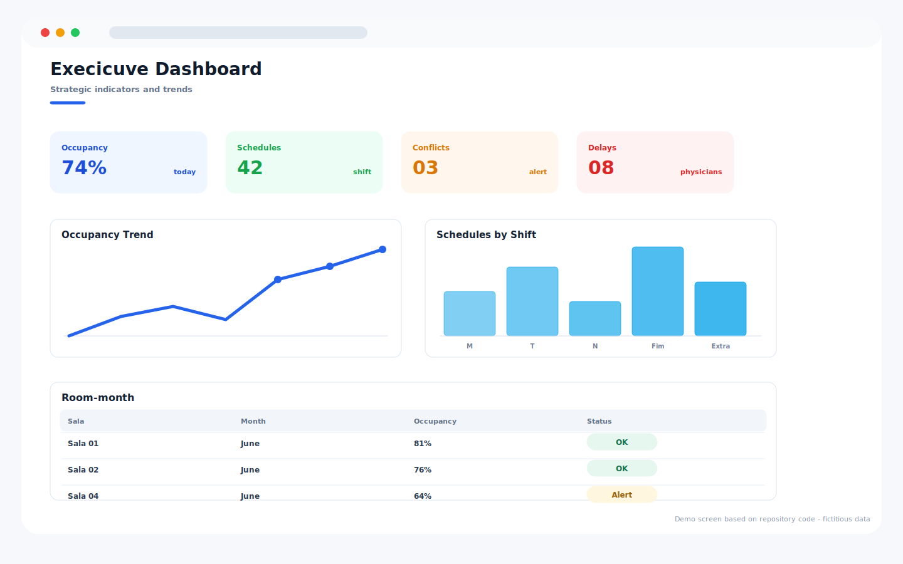

# Gama Room Scheduling System

Repository: `Gama_agendamento_sala`

## Overview

Room scheduling and monitoring system for hospital spaces, shifts, professionals, dashboards, registrations, and audit logs.

## Main Capabilities

- Login screen with staff identifier and password fields.
- Real-time room monitor with date and shift controls.
- Planning, dashboard, report, registration, physician, room-month, and log areas.
- Administrative registration surfaces for rooms, islands, specialties, and professionals.

## Operating Flow

1. The user signs in with a staff identifier.
2. The monitor shows room availability for the selected date and shift.
3. Planning and registrations keep room usage aligned with the official schedule.
4. Dashboards and logs support trend review and operational auditing.

## Visual System Guide

> The screens below are documentation mockups based on the components, labels, colors, and workflows found in this repository. All displayed data is fictitious and does not represent real patients, staff members, or institutions.

### Gama - login

### Gama - room monitor

### Gama - management and registrations

### Gama - executive dashboard

## Data Privacy

The repository documentation and guide images use fictitious sample data only.

## Technologies

- JavaScript
- HTML/CSS
- Google Apps Script
- Google Sheets

## Status

Completed
